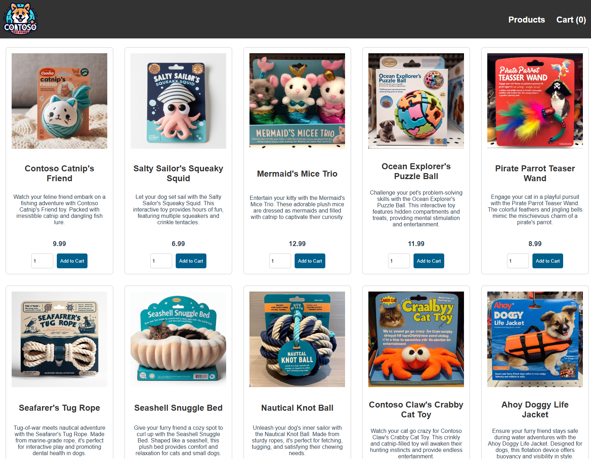
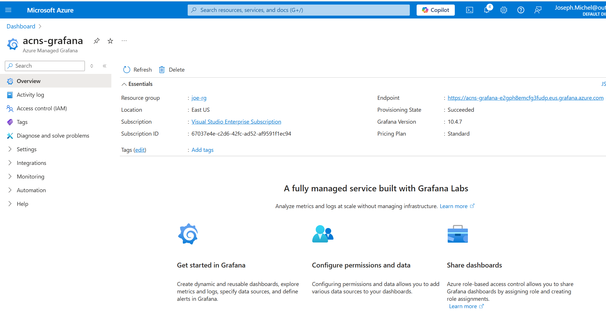
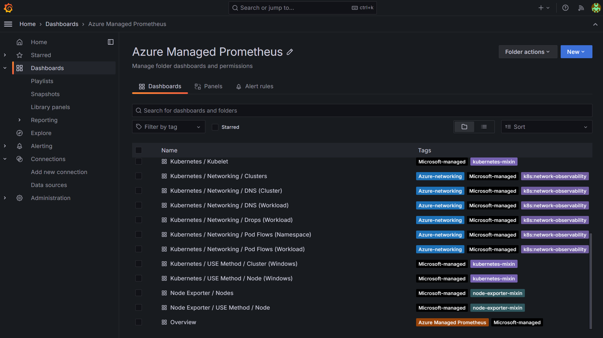
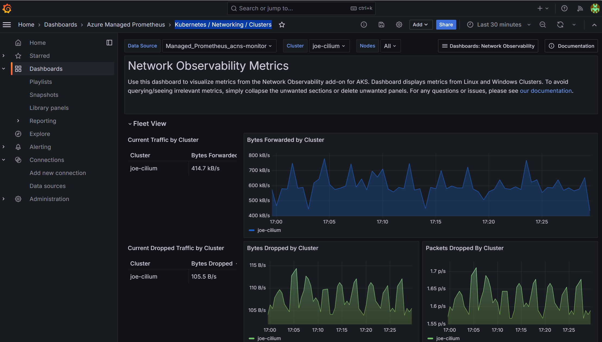
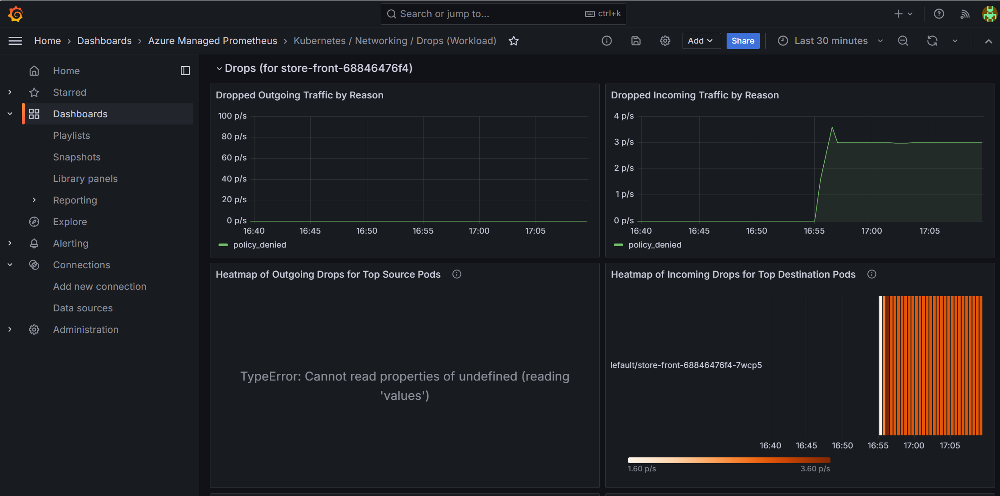
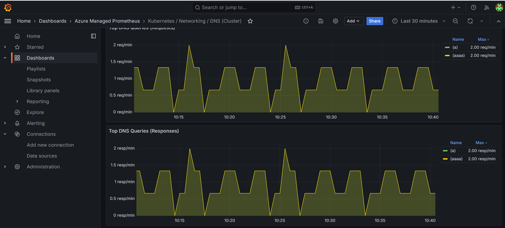
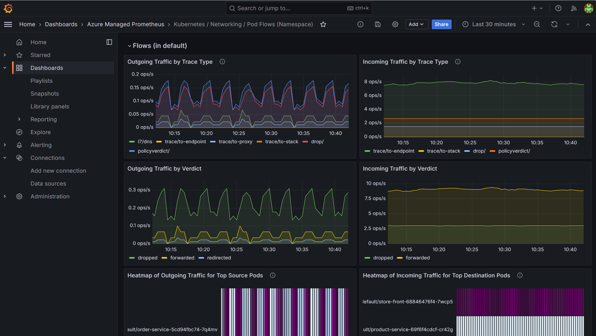
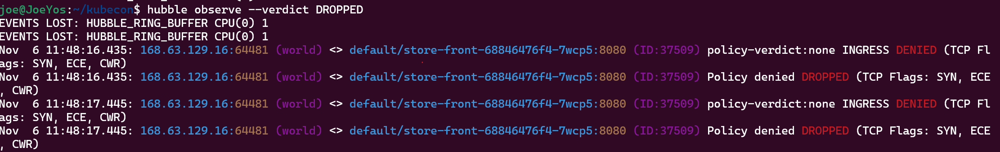
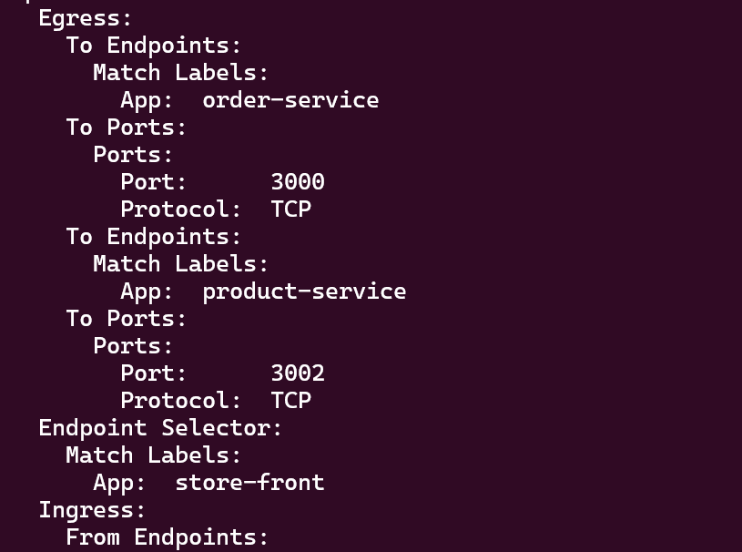

# ACNS_Workshop

Advanced Container Networking Services (ACNS) is a suite of services built to significantly enhance the operational capabilities of your Azure Kubernetes Service (AKS) clusters. 
Advanced Container Networking Services contains features split into two pillars:

- Security: For clusters using Azure CNI Powered by Cilium, network policies include fully qualified domain name (FQDN) filtering for tackling the complexities of maintaining configuration.
- Observability: The inaugural feature of the Advanced Container Networking Services suite bringing the power of Hubble’s control plane to both Cilium and non-Cilium Linux data planes. These features aim to provide visibility into networking and performance.


## Cluster Setup 

Install the aks-preview Azure CLI extension

```bash
# Install the aks-preview extension
az extension add --name aks-preview

# Update the extension to make sure you have the latest version installed
az extension update --name aks-preview
```

Register the AdvancedNetworkingPreview feature flag

```bash
# Register the az feature register --namespace "Microsoft.ContainerService" --name "AdvancedNetworkingPreview" feature flag using the az feature register command.
az feature register --namespace "Microsoft.ContainerService" --name "AdvancedNetworkingPreview"
# Verify successful registration using the az feature show command
az feature show --namespace "Microsoft.ContainerService" --name "AdvancedNetworkingPreview"
```

Create a resource group

```bash
# Set environment variables for the resource group name and location. Make sure to replace the placeholders with your own values.
export RESOURCE_GROUP="<resource-group-name>"
export LOCATION="<azure-region>"

# Create a resource group
az group create --name $RESOURCE_GROUP --location $LOCATION
```

Create an AKS cluster with Advanced Network Observability

```bash
# Set an environment variable for the AKS cluster name. Make sure to replace the placeholder with your own value.
export CLUSTER_NAME="<aks-cluster-name>"

# Create an AKS cluster with Cilium data plane
az aks create --name $CLUSTER_NAME --resource-group $RESOURCE_GROUP --generate-ssh-keys --location eastus --max-pods 250 --network-plugin azure --network-plugin-mode overlay --network-dataplane cilium --node-count 2 --pod-cidr 192.168.0.0/16 --kubernetes-version 1.29 --enable-acns
```

Get cluster credentials
```bash
az aks get-credentials --name $CLUSTER_NAME --resource-group $RESOURCE_GROUP
```

## Azure managed Prometheus and Grafana

Create Azure Monitor resource

```bash
#Set an environment variable for the Grafana name. Make sure to replace the placeholder with your own value.
export AZURE_MONITOR_NAME="<azure-monitor-name>"

# Create Azure monitor resource
az resource create --resource-group $RESOURCE_GROUP --namespace microsoft.monitor --resource-type accounts --name $AZURE_MONITOR_NAME --location eastus --properties '{}'
```

Create Grafana instance

```bash
# Set an environment variable for the Grafana name. Make sure to replace the placeholder with your own value.
export GRAFANA_NAME="<grafana-name>"

# Create Grafana instance
az grafana create --name $GRAFANA_NAME --resource-group $RESOURCE_GROUP
```

Place the Grafana and Azure Monitor resource IDs in variables

```bash
grafanaId=$(az grafana show --name $GRAFANA_NAME --resource-group $RESOURCE_GROUP --query id --output tsv)
azuremonitorId=$(az resource show --resource-group $RESOURCE_GROUP --name $AZURE_MONITOR_NAME --resource-type "Microsoft.Monitor/accounts" --query id --output tsv)
```

Link Azure Monitor and Grafana to the AKS cluste

```bash
az aks update --name $CLUSTER_NAME --resource-group $RESOURCE_GROUP --enable-azure-monitor-metrics --azure-monitor-workspace-resource-id $azuremonitorId --grafana-resource-id $grafanaId
```

## Install Hubble CLI

```bash
# Set environment variables
export HUBBLE_VERSION=v0.11.0
export HUBBLE_ARCH=amd64

#Install Hubble CLI
if [ "$(uname -m)" = "aarch64" ]; then HUBBLE_ARCH=arm64; fi
curl -L --fail --remote-name-all https://github.com/cilium/hubble/releases/download/$HUBBLE_VERSION/hubble-linux-${HUBBLE_ARCH}.tar.gz{,.sha256sum}
sha256sum --check hubble-linux-${HUBBLE_ARCH}.tar.gz.sha256sum
sudo tar xzvfC hubble-linux-${HUBBLE_ARCH}.tar.gz /usr/local/bin
rm hubble-linux-${HUBBLE_ARCH}.tar.gz{,.sha256sum}
```

Port forward Hubble Relay using the kubectl port-forward command.

```bash
kubectl port-forward -n kube-system svc/hubble-relay --address 127.0.0.1 4245:443
```

Configure the client with hubble certificate

```bash
#!/usr/bin/env bash

set -euo pipefail
set -x

# Directory where certificates will be stored
CERT_DIR="$(pwd)/.certs"
mkdir -p "$CERT_DIR"

declare -A CERT_FILES=(
  ["tls.crt"]="tls-client-cert-file"
  ["tls.key"]="tls-client-key-file"
  ["ca.crt"]="tls-ca-cert-files"
)

for FILE in "${!CERT_FILES[@]}"; do
  KEY="${CERT_FILES[$FILE]}"
  JSONPATH="{.data['${FILE//./\\.}']}"

# Retrieve the secret and decode it
  kubectl get secret hubble-relay-client-certs -n kube-system -o jsonpath="${JSONPATH}" | base64 -d > "$CERT_DIR/$FILE"

# Set the appropriate hubble CLI config
  hubble config set "$KEY" "$CERT_DIR/$FILE"
done

hubble config set tls true
hubble config set tls-server-name instance.hubble-relay.cilium.io
```

## Install hubble UI

Apply the hubble-ui.yaml manifest to your cluster, using the following command

```bash
kubectl apply -f https://raw.githubusercontent.com/JosephYostos/ACNS_Workshop/refs/heads/main/assets/hubble_UI.yaml
```

Set up port forwarding for Hubble UI using the kubectl port-forward command.
```bash
kubectl -n kube-system port-forward svc/hubble-ui 12000:80
```
Access Hubble UI by entering http://localhost:12000/ into your web browser.

## Setting Up the Demo Application

In this section, we’ll deploy a sample application to demonstrate ACNS networking policies in action

The application has the following service 

| Service | Description |
| --- | --- |
| `store-front` | Web app for customers to place orders (Vue.js) |
| `order-service` | This service is used for placing orders (Javascript) |
| `product-service` | This service is used to perform CRUD operations on products (Rust) |
| `rabbitmq` | RabbitMQ for an order queue |

First, deploy the Pet Shop application in the default namespace.

```bash
kubectl apply -f https://raw.githubusercontent.com/Azure-Samples/aks-store-demo/refs/heads/main/aks-store-quickstart.yaml
```

Part of this deployment is a loadblalncer service to access the application ui, use the following command to get the UI IP address,

```bash
kubectl get svc store-front
```

Copy the EXTERNAL-IP of the `store-front` service to your browser to access the application



## Enforce Network Policy 

by default all traffic is allowed in kubernetes, let's do so testing

```bash
# testing connection with external world
kubectl exec -it $(kubectl get po -l app=order-service -ojsonpath='{.items[0].metadata.name}')  -- sh -c 'wget www.bing.com'

# testing connection between order-service product-service which is not required by architecture
kubectl exec -it $(kubectl get po -l app=order-service -ojsonpath='{.items[0].metadata.name}')  -- sh -c 'nc -zv -w2 product-service.default 3002'
```

Now, let's deploy some network policy to allow only the required ports 

```bash
kubectl apply -f https://raw.githubusercontent.com/JosephYostos/ACNS_Workshop/refs/heads/main/assets/neywork_policy.yaml
```

review the created policies

```bash
kubectl get cnp
```

No if we access the pet shop app UI we should be able to order any product normally but if we test connection with external world and unwantd internal connections that should be blocked.
let's run our test again 

```bash
# testing connection with external world
kubectl exec -it $(kubectl get po -l app=order-service -ojsonpath='{.items[0].metadata.name}')  -- sh -c 'wget www.bing.com'

# testing connection between order-service product-service which is not required by architecture
kubectl exec -it $(kubectl get po -l app=order-service -ojsonpath='{.items[0].metadata.name}')  -- sh -c 'nc -zv -w2 product-service.default 3002'
```

## FQDN policy 

Now the application Owner contacted you asking why his pets shop application is not able to contact Microsoft Graph API.

let's try 

```bash
kubectl exec -it $(kubectl get po -l app=order-service -ojsonpath='{.items[0].metadata.name}')  -- sh -c 'wget https://graph.microsoft.com'
```

This is an expected behaviour because we have implemented zero trust security policy and denying any traffic and just enabling the required ones.

To allow the access to Microsoft Graph API we will create fqdn Network policy 
Note: FQDN filtering requires ACNS to be enabled 

```bash
kubectl apply -f assets/fqdn_policy.yaml
```

Now if we try to acccess Microsoft Graph API from order-service app, that should be allowed.
```bash
kubectl exec -it $(kubectl get po -l app=order-service -ojsonpath='{.items[0].metadata.name}')  -- sh -c 'wget https://graph.microsoft.com'
```

## Network Metrics with Grafana 

let's start with applying the chaos policy to generate some drop traffic 

```bash
kubectl apply -f assets/chaos_policy.yaml
```

In the previous section we were able to enable traffic to a specific fqdn but it looks that something wrong happened, customers are not able to access the pet shop anymore 

Let's use grafana dashboard to see what's wrong

From your browser, navigate to [Azure Portal](https://aka.ms/publicportal), search for _acns-grafana_ resource, then click on the _endpoint_ link


Part of ACNS we proivide pre-definied networking dashboards. Review the avilable dashboards 


you can start with the _Kubernetes / Networking / Clusters_ dashboard to get an over view of whats is happeing in the cluster 



Lets' change the view to the  _Kubernetes / Networking / Drops_, select the _default_ namespace, and _store-front_ workload  



Now you can see increase in the dropped incomming traffic and the reason is "policy_denied" so now we now the reason that something was wrong with the network policy. let's dive dipper and understand why this is happening

[Optional] Famliarize yourself with the other dashobards for DNS, and pod flows

|  |  |
|-------------------------------|-------------------------------|


## observe network flows woth hubble 
=====> what is hubble as part of ACNS 

We aready have hubble installed in the cluster. check Hubble pods are running using the `kubectl get pods` command. 

```bash
kubectl get pods -o wide -n kube-system -l k8s-app=hubble-relay
```

Your output should look similar to the following example output:

`hubble-relay-7ddd887cdb-h6khj     1/1  Running     0       23h` 

First we need to port forward the hubble relay traffic

```bash
kubectl port-forward -n kube-system svc/hubble-relay --address 127.0.0.1 4245:443
```

Using hubble we will look for what is dropped 

```bash
hubble observe --verdict DROPPED
```

Here we can see traffic comming from world dropped in frontstore 




So now we can tell that there is a problem with the frontend ingress traffic configureation, lets review the `allow-store-front-traffic` policy 

```bash
kubectl describe cnp allow-store-front-traffic
```

here we go, we see that the Ingress gtraffic is not allowed 


Now to solve the problem we will apply the original 

```bash
kubectl apply -f assets/allow-store-front-traffic.yaml
```

And finally our pets applications back to live 


